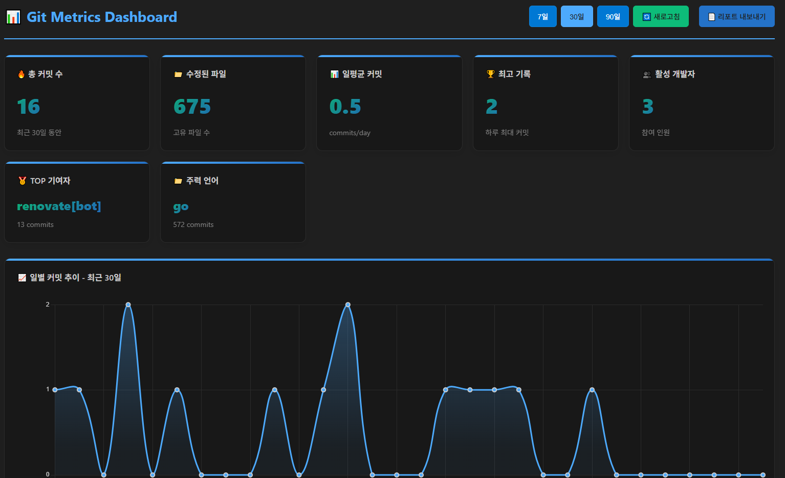
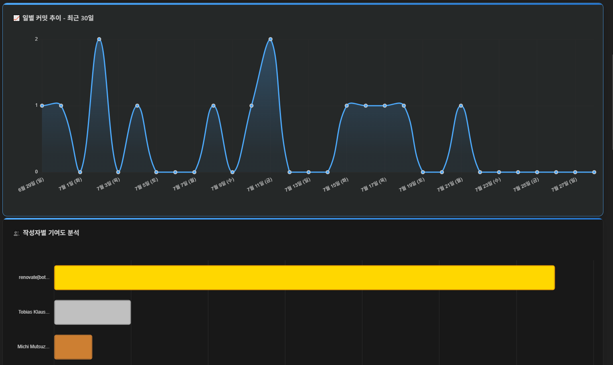
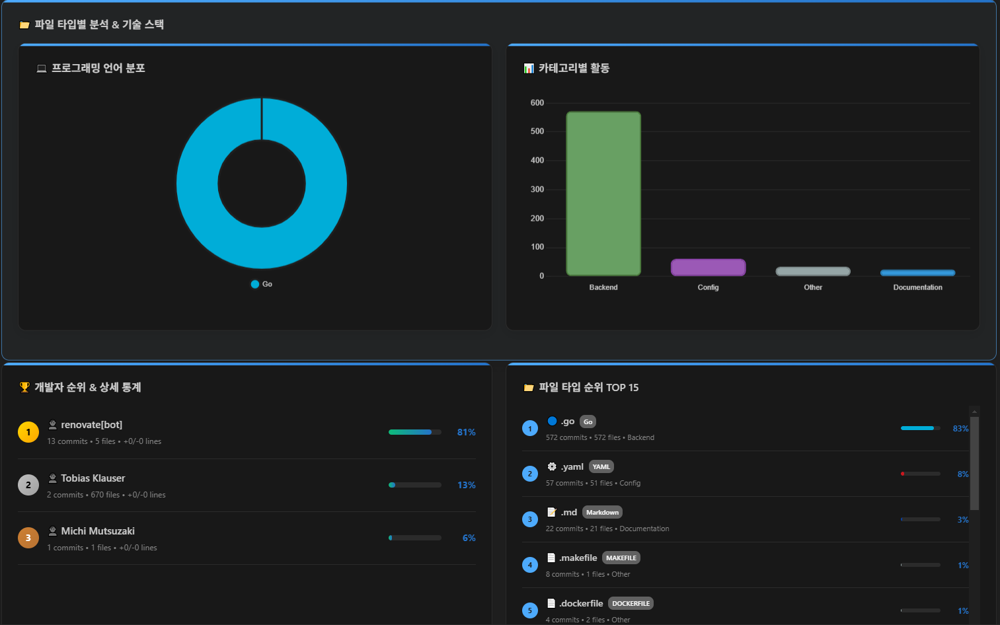
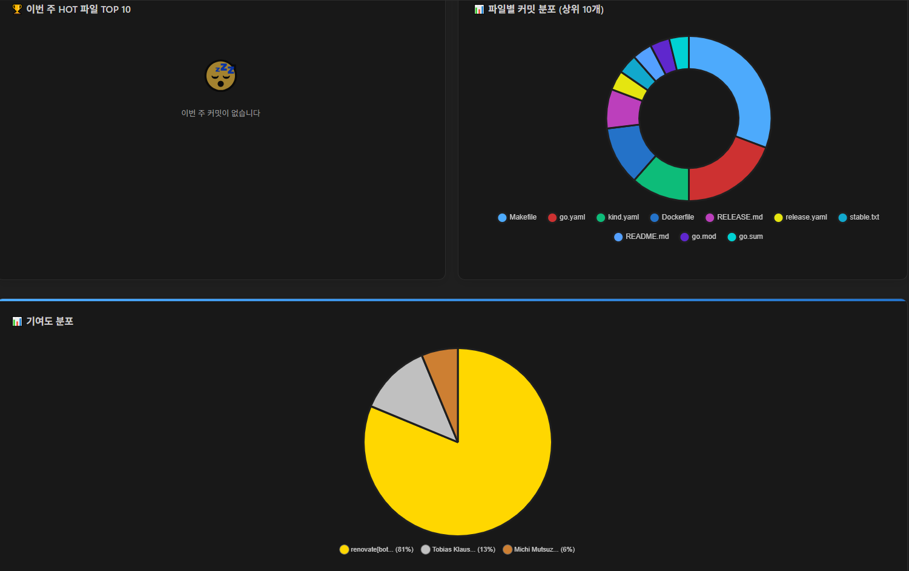
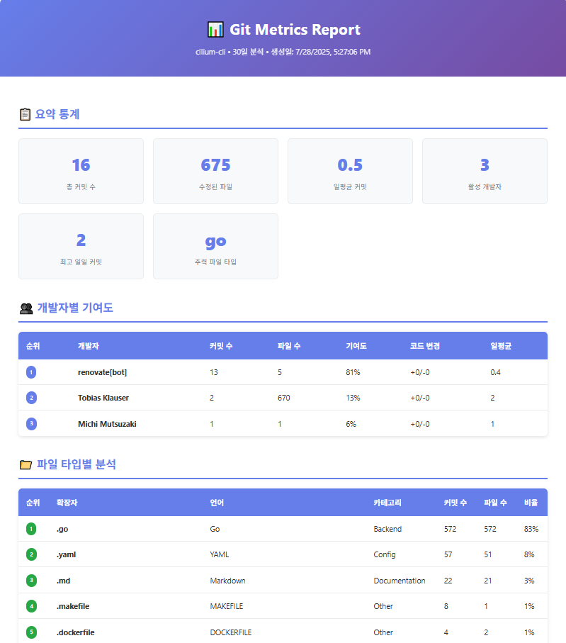

<!-- # 📊 Git Metrics Dashboard

> 팀의 Git 활동을 실시간으로 분석하고 시각화하는 VSCode Extension  
> Real-time Git activity analysis and visualization for development teams

[](https://code.visualstudio.com/)
[](https://www.typescriptlang.org/)
[](LICENSE)

## ✨ 주요 기능 (Key Features)


### 📈 **일별 커밋 추이 분석**
- 최근 7일/30일/90일 커밋 트렌드를 라인 차트로 시각화
- 일평균 커밋 수, 최고 기록 등 핵심 메트릭 제공
- Interactive line chart showing commit trends over 7/30/90 days

### 👥 **작성자별 기여도 분석**
- 개발자별 커밋 수, 수정 파일 수, 코드 라인 변경량 추적
- 개인별 작업 패턴 및 활동 주기 분석
- Team member contribution ranking with medal system

### 📁 **파일 타입별 기술 스택 분석**
- **20+ 프로그래밍 언어** 자동 인식 및 분류
- Frontend/Backend/Mobile/Database 카테고리별 활동 분포
- 언어별 색상 코딩 및 아이콘으로 직관적 표시
- Technology stack analysis with 20+ programming languages

### ⏰ **시간대별 작업 패턴 분석**
- **24시간 레이더 차트**로 시간대별 활동 패턴
- **요일별 폴라 차트**로 주간 작업 분포
- **히트맵**으로 요일×시간 매트릭스 시각화
- 야간형/주말형/정규형/균형형 작업 스타일 자동 분류
- Comprehensive time-based activity analysis with heatmaps

### 🔄 **실시간 자동 새로고침**
- 10초~5분 간격으로 자동 업데이트
- 실시간 카운트다운 및 상태 표시
- 팀 모니터링용 대시보드 모드
- Real-time auto-refresh with countdown timer

## 🚀 설치 방법 (Installation)
### 1. 직접 설치 (Direct Installation)
```bash
# 저장소 클론
git clone https://github.com/jiwan8985/git-metrics-dashboard.git
cd git-metrics-dashboard

# 의존성 설치
npm install

# 컴파일
npm run compile
```

### 2. 개발 모드 실행
1. VSCode에서 프로젝트 열기
2. `F5` 키를 눌러 Extension Development Host 실행
3. Git 저장소가 있는 폴더 열기
4. `Ctrl+Shift+P` → "Git Metrics Dashboard 열기" 실행

## 📊 사용법 (Usage)
### 기본 사용법
1. **Git 저장소**가 있는 VSCode 워크스페이스 열기
2. 명령 팔레트(`Ctrl+Shift+P`) 열기
3. **"📊 Git Metrics Dashboard 열기"** 명령 실행
4. 대시보드에서 다양한 메트릭 확인

### 자동 새로고침 설정
```typescript
// settings.json
{
  "gitMetrics.autoRefresh": true,           // 자동 새로고침 활성화
  "gitMetrics.autoRefreshInterval": 30,     // 30초 간격
  "gitMetrics.enableNotifications": true    // 알림 표시
}
```

## ⚙️ 설정 옵션 (Configuration)
| 설정 | 기본값 | 설명 |
|------|--------|------|
| `gitMetrics.defaultPeriod` | `30` | 기본 분석 기간 (일)           
| `gitMetrics.autoRefresh` | `false` | 자동 새로고침 활성화         
| `gitMetrics.autoRefreshInterval` | `30` | 새로고침 간격 (초)      
| `gitMetrics.maxTopFiles` | `10` | 상위 파일 표시 개수             
| `gitMetrics.enableNotifications` | `true` | 새로고침 알림 표시    


### 🎯 지원하는 언어 및 기술 스택
```
Frontend:  🟨 JavaScript  ⚛️ React  🔷 TypeScript  💚 Vue.js
Backend:   🐍 Python  ☕ Java  🔵 Go  🦀 Rust  🐘 PHP
Mobile:    🍎 Swift  🎯 Dart  📱 Kotlin
Database:  🗃️ SQL  📋 JSON  ⚙️ YAML
Scripts:   🖥️ Shell  📄 Batch  💻 PowerShell
```

## 🛠️ 개발 환경 (Development)
### 시스템 요구사항
- **VSCode**: 1.102.0 이상
- **Node.js**: 20.x 이상
- **TypeScript**: 5.8.3 이상
- **Git**: 저장소 필수

### 개발 명령어
```bash
# 개발 모드 실행
npm run watch

# 컴파일
npm run compile  

# 린트 검사
npm run lint

# 테스트 실행
npm test

# VSIX 패키지 생성
vsce package
```

## 📋 주요 메트릭 (Key Metrics)
### 📊 **기본 통계**
- 총 커밋 수 및 수정된 파일 수
- 일평균 커밋 수 및 최고 기록
- 활성 개발자 수 및 TOP 기여자

### 👥 **작성자 분석**
- 개발자별 커밋 수, 파일 수, 코드 라인 변경량
- 기여도 퍼센티지 및 순위
- 첫 커밋/마지막 커밋 날짜
- 일평균 커밋 수

### 📁 **파일 타입 분석**
- 확장자별 커밋 분포
- 프로그래밍 언어별 활동량
- Frontend/Backend/Mobile 카테고리 분류

### ⏰ **시간 패턴 분석**
- 시간대별/요일별 활동 분포
- 야간 작업 비율 (22시-06시)
- 주말 작업 비율
- 핵심 근무시간 (연속 8시간 구간)
- 작업 패턴 분류: 🦉야간형 🏖️주말형 🏢정규형 ⚖️균형형

## 🤝 기여 방법 (Contributing)
1. 저장소를 Fork
2. 새로운 기능 브랜치 생성 (`git checkout -b feature/amazing-feature`)
3. 변경사항 커밋 (`git commit -m 'Add amazing feature'`)
4. 브랜치에 Push (`git push origin feature/amazing-feature`)
5. Pull Request 생성

## 🐛 버그 리포트 (Bug Reports)
버그를 발견하셨나요? [Issues](https://github.com/jiwan8985/git-metrics-dashboard/issues)에서 다음 정보와 함께 제보해주세요:
- VSCode 버전
- Extension 버전
- Git 저장소 정보
- 재현 단계
- 예상 결과 vs 실제 결과

## 🔮 로드맵 (Roadmap)
### 🚧 개발 예정 기능
- [ ] 📤 **리포트 내보내기** (PDF, PNG, CSV)
- [ ] 📊 **커스텀 대시보드** 위젯 구성
- [ ] 🔔 **슬랙/팀즈 통합** 알림
- [ ] 📈 **트렌드 예측** AI 분석
- [ ] 🌐 **웹 대시보드** 공유 기능
- [ ] 📱 **모바일 알림** 지원
- [ ] 🎨 다크/라이트 테마 커스터마이징
- [ ] 🔍 고급 필터링 및 검색
- [ ] 📊 커스텀 메트릭 정의
- [ ] 🏆 개발자 뱃지 시스템

## 📄 라이센스 (License)
이 프로젝트는 [MIT License](LICENSE) 하에 배포됩니다.

## 👏 감사 인사 (Acknowledgments)
- [Chart.js](https://www.chartjs.org/) - 데이터 시각화
- [VSCode Extension API](https://code.visualstudio.com/api) - Extension 개발 프레임워크
- Git 커뮤니티의 모든 기여자들

---
<div align="center">

**⭐ 이 프로젝트가 유용하다면 별표를 눌러주세요! ⭐**
Made with ❤️ by developers, for developers
[🐛 버그 리포트](https://github.com/jiwan8985/git-metrics-dashboard/issues) | [💡 기능 제안](https://github.com/jiwan8985/git-metrics-dashboard/issues) | [📖 문서](https://github.com/jiwan8985/git-metrics-dashboard/wiki)
</div> -->

# 📊 Git Metrics Dashboard


Git 저장소의 커밋 통계와 메트릭을 시각적으로 분석하고, 다양한 형식으로 리포트를 내보낼 수 있는 VS Code 확장 프로그램입니다.

## ✨ 주요 기능

### 📈 대시보드 기능
- **실시간 Git 통계**: 커밋 수, 파일 변경, 개발자별 기여도 등
- **시각적 차트**: Chart.js를 활용한 인터랙티브 차트
- **개발자별 분석**: 순위, 기여도, 활동 패턴 분석
- **파일 타입별 분석**: 프로그래밍 언어별 통계
- **시간대별 분석**: 시간별, 요일별 활동 패턴

### 📄 리포트 내보내기 (NEW!)
- **다양한 포맷 지원**: HTML, JSON, CSV, Markdown
- **사용자 정의 옵션**: 기간, 포함 섹션 선택 가능
- **프로페셔널 리포트**: 회사 보고서나 프로젝트 문서용
- **자동화 친화적**: JSON/CSV 형식으로 추가 분석 가능

## 🚀 설치 방법

1. VS Code Marketplace에서 "Git Metrics Dashboard" 검색
2. 설치 버튼 클릭
3. Git 저장소가 있는 워크스페이스에서 사용

## 📋 사용 방법

### 대시보드 사용
1. **상태바에서 실행**: `📊 Git Stats` 버튼 클릭
2. **명령 팔레트**: `Ctrl+Shift+P` → "Git Metrics Dashboard 열기"
3. **키보드 단축키**: `Ctrl+Shift+G` → `Ctrl+Shift+D`

### 리포트 내보내기
1. **빠른 내보내기**:
   - 상태바의 `📄 Export` 버튼 클릭
   - 또는 `Ctrl+Shift+G` → `Ctrl+Shift+E`
   
2. **사용자 정의 내보내기**:
   - 명령 팔레트 → "사용자 정의 리포트 내보내기"
   - 분석 기간, 포맷, 포함 섹션 선택

3. **대시보드에서 내보내기**:
   - 대시보드 우상단 "📄 리포트 내보내기" 버튼

## 📊 리포트 형식

### HTML 리포트
- 웹 브라우저에서 볼 수 있는 인터랙티브 리포트
- 프린트 친화적 디자인
- 회사 프레젠테이션이나 문서화에 적합

### JSON 리포트
- 프로그래밍적 처리를 위한 구조화된 데이터
- API 연동이나 추가 분석 도구와 연계 가능
- 자동화된 리포팅 시스템에 적합

### CSV 리포트
- Excel이나 Google Sheets에서 열기 가능
- 표 형식의 데이터 분석에 적합
- 통계 소프트웨어와 연동 가능

### Markdown 리포트
- GitHub README 스타일 문서
- 프로젝트 문서화에 적합
- 버전 관리 시스템에 포함 가능

## ⚙️ 설정 옵션

```json
{
  "gitMetrics.defaultPeriod": 30,                    // 기본 분석 기간 (일)
  "gitMetrics.maxTopFiles": 10,                      // 상위 파일 표시 개수
  "gitMetrics.export.defaultFormat": "html",         // 기본 내보내기 형식
  "gitMetrics.export.autoOpenAfterExport": false,    // 내보내기 후 자동 열기
  "gitMetrics.export.customReportsPath": ""          // 사용자 정의 저장 경로
}
```

## 📁 리포트 저장 위치

리포트는 기본적으로 다음 위치에 저장됩니다:
```
프로젝트루트/
├── git-metrics-reports/
│   ├── git-metrics-report-2025-01-15-30days.html
│   ├── git-metrics-report-2025-01-15-30days.json
│   └── ...
```

## 🎯 사용 사례

### 팀 리더/매니저
- 팀원별 기여도 분석
- 프로젝트 진행 상황 모니터링
- 월별/분기별 리포트 생성

### 개발자
- 개인 개발 활동 추적
- 기술 스택 분석
- 작업 패턴 최적화

### 프로젝트 관리
- 코드베이스 건강도 체크
- 기술 부채 파악
- 리소스 배분 최적화

## 🔧 명령어

| 명령어 | 단축키 | 설명 |
|--------|--------|------|
| `gitMetrics.showDashboard` | `Ctrl+Shift+G` `D` | 대시보드 열기 |
| `gitMetrics.quickExport` | `Ctrl+Shift+G` `E` | 빠른 리포트 내보내기 |
| `gitMetrics.customExport` | - | 사용자 정의 리포트 내보내기 |
| `gitMetrics.openReportsFolder` | - | 리포트 폴더 열기 |

## 📸 스크린샷

### 대시보드






### HTML 리포트


## 🤝 기여하기

1. Fork the repository
2. Create a feature branch (`git checkout -b feature/amazing-feature`)
3. Commit your changes (`git commit -m 'Add amazing feature'`)
4. Push to the branch (`git push origin feature/amazing-feature`)
5. Open a Pull Request

## 📝 변경사항

### v0.0.4 (2025-07-28)
- ✨ **NEW** : README 수정

### v0.0.3 (2025-07-28)
- ✨ **NEW**: 리포트 내보내기 기능 추가
- ✨ **NEW**: HTML, JSON, CSV, Markdown 형식 지원
- ✨ **NEW**: 사용자 정의 리포트 옵션
- ✨ **NEW**: 빠른 내보내기 기능
- 🎨 **IMPROVED**: 대시보드 UI 개선
- 🎨 **IMPROVED**: 차트 인터랙션 향상

### v0.0.2 (이전 버전)
- 기본 대시보드 기능
- 개발자별 통계
- 파일 타입별 분석

## 🛠️ 문제 해결

### 일반적인 문제
리포트 내보내기가 작동하지 않는 경우:
1. Git 저장소인지 확인 (`git status` 명령어 실행)
2. 폴더 쓰기 권한 확인
3. VS Code를 관리자/sudo 권한으로 재시작
4. 설정에서 다른 저장 경로로 변경 시도

### 자주 묻는 질문
1. Git 저장소인지 확인
2. 분석 기간에 커밋이 있는지 확인
3. 파일 쓰기 권한 확인

### 차트가 표시되지 않을 때
1. 브라우저에서 JavaScript 활성화 확인
2. VS Code 재시작

## 📄 라이선스

MIT License - 자세한 내용은 [LICENSE](LICENSE) 파일을 확인하세요.

## 🙋‍♂️ 지원

- 🐛 **버그 리포트**: [GitHub Issues](https://github.com/jiwan8985/git-metrics-dashboard/issues)
- 💡 **기능 요청**: [GitHub Issues](https://github.com/jiwan8985/git-metrics-dashboard/issues)
- 📧 **문의**: jiwan8985@gmail.com

---

⭐ 이 확장 프로그램이 유용하다면 [GitHub](https://github.com/jiwan8985/git-metrics-dashboard)에서 스타를 눌러주세요!