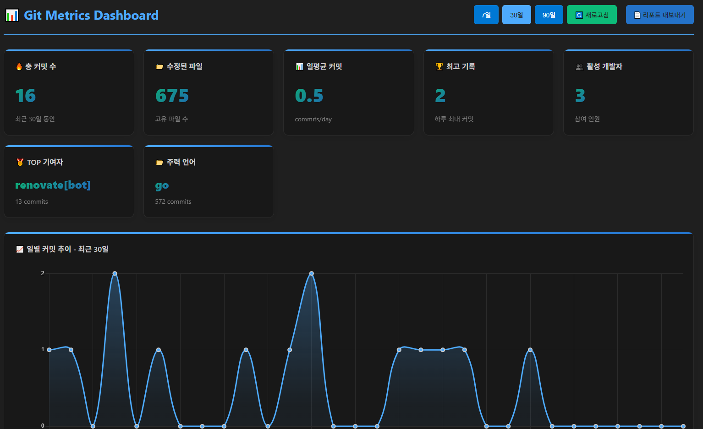
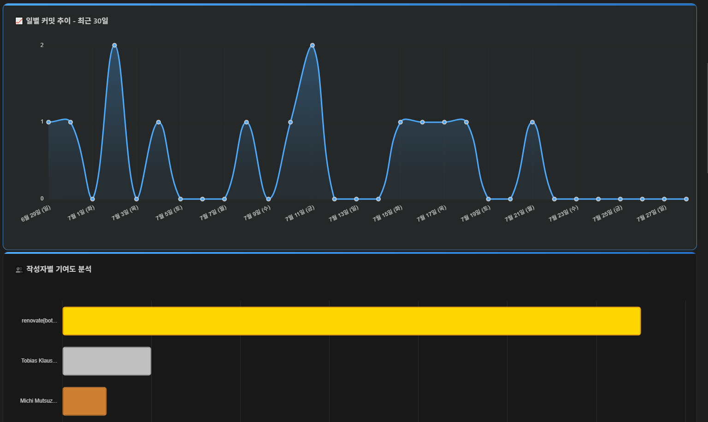
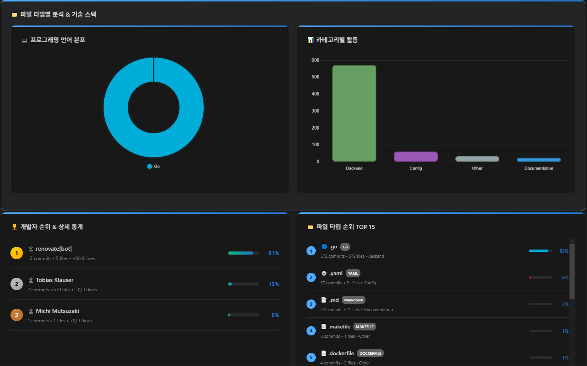
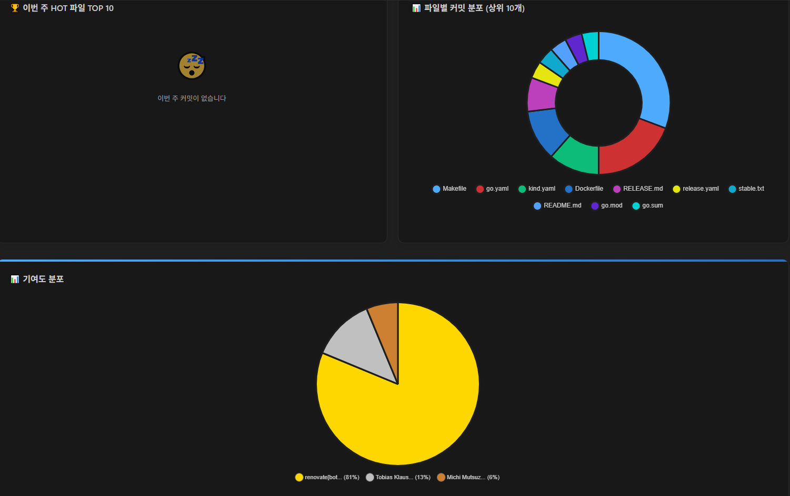
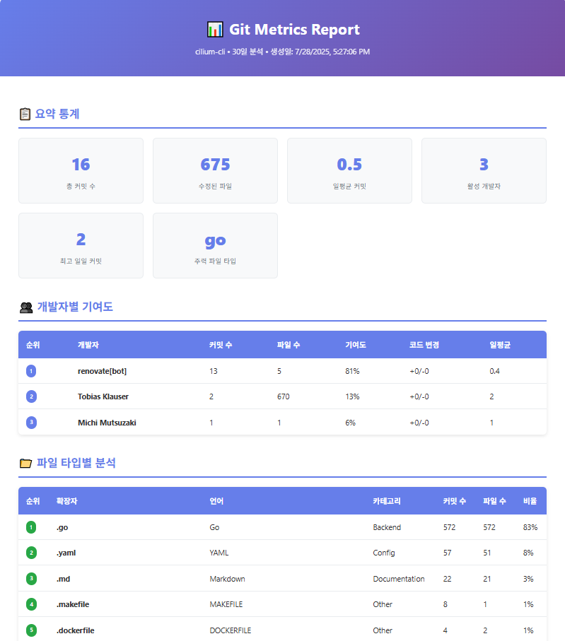

# 📊 Git Metrics Dashboard

> **Comprehensive Git Repository Analytics and Metrics Dashboard for VS Code**


A powerful VS Code extension that provides comprehensive Git repository analytics with beautiful visualizations, achievement badges, and multi-format report exports.

**English** | [한국어](./README.ko.md) | [日本語](./README.ja.md) | [简体中文](./README.zh-CN.md)

---

## ✨ Key Features

### 📈 Dashboard Analytics
- **Commit Streak** — current and longest consecutive commit streak with activity rate
- **Week-over-Week Trend** — compare commit volume between first and second half of the period (▲▼ indicator)
- **Conventional Commits Analysis** — compliance rate for feat/fix/chore/docs/etc. with donut chart
- **Branch Status** — current branch name, total and active branch counts
- **Real-time Git Statistics** — total commits, file changes, contributor metrics
- **Real-time Change Detection** — auto-refresh dashboard on commits, branch switches, and file staging
- **Interactive Charts** — Chart.js-powered visualizations
- **Contributor Rankings** — contribution metrics and activity patterns per author
- **File Type Analysis** — support for 70+ programming languages
- **Time-based Analysis** — hourly and daily activity heatmaps
- **Achievement Badges** — gamification system to track development milestones
- **Smart Themes** — full dark / light / auto theme support

### 📄 Report Export
- **Multiple Formats**: HTML, JSON, CSV, Markdown
- **Theme Integration**: VS Code theme automatically applied to HTML reports
- **Customizable**: choose analysis period, format, and which sections to include
- **Badge Integration**: achievement badges included in reports
- **Professional Quality**: suitable for team presentations and documentation

---

## 🚀 Installation

1. Open VS Code
2. Search **"Git Metrics Dashboard"** in the Extensions Marketplace (`Ctrl+Shift+X`)
3. Click **Install**
4. Open any Git repository in your workspace

---

## 📋 Usage

### Open Dashboard
| Method | Action |
|--------|--------|
| Status Bar | Click the `📊 Git Stats` button |
| Command Palette | `Ctrl+Shift+P` → **Git Metrics: Open Dashboard** |
| Keyboard Shortcut | `Ctrl+Shift+G` → `Ctrl+Shift+D` (Win/Linux) / `Cmd+Shift+G` → `Cmd+Shift+D` (Mac) |

### Export Reports
| Method | Action |
|--------|--------|
| Quick Export | `Ctrl+Shift+G` → `Ctrl+Shift+E` |
| Custom Export | Command Palette → **Git Metrics: Custom Export Report** |
| Dashboard button | Click **📄 Export Report** inside the dashboard |

### Switch Theme
- Status bar theme button: 🔄 Auto / ☀️ Light / 🌙 Dark
- Keyboard: `Ctrl+Shift+G` → `Ctrl+Shift+T`

---

## 📊 Report Formats

| Format | Best For |
|--------|----------|
| **HTML** | Interactive browser view, team presentations, print-friendly |
| **JSON** | Programmatic processing, API integration, automation |
| **CSV** | Excel / Google Sheets analysis, statistical tools |
| **Markdown** | GitHub README inclusion, project documentation |

Reports are saved to `<workspace>/git-metrics-reports/` by default (configurable).

---

## ⚙️ Configuration

```json
{
  "gitMetrics.defaultPeriod": 30,
  "gitMetrics.maxTopFiles": 10,
  "gitMetrics.theme": "auto",
  "gitMetrics.language": "auto",
  "gitMetrics.autoRefresh": false,
  "gitMetrics.autoRefreshInterval": 5000,
  "gitMetrics.showChangeNotification": false,
  "gitMetrics.export.defaultFormat": "html",
  "gitMetrics.export.useThemeInReports": true,
  "gitMetrics.export.autoOpenAfterExport": false,
  "gitMetrics.export.customReportsPath": ""
}
```

| Setting | Default | Description |
|---------|---------|-------------|
| `defaultPeriod` | `30` | Analysis period in days (1–365) |
| `theme` | `"auto"` | Dashboard theme: `auto` / `light` / `dark` |
| `language` | `"auto"` | UI language: `auto` / `en` / `ko` / `ja` / `zh-CN` |
| `autoRefresh` | `false` | Auto-refresh on Git changes |
| `autoRefreshInterval` | `5000` | Change detection interval in ms |

---

## 📸 Screenshots

### Dashboard





### HTML Report


---

## 🎯 Use Cases

**Team Leads / Managers**
- Analyze per-contributor metrics and velocity
- Generate monthly / quarterly reports
- Monitor project progress and code health

**Individual Developers**
- Track personal coding activity and streaks
- Analyze your technology stack usage
- Understand your commit patterns and productivity peaks

**Project Management**
- Codebase health overview
- Identify technical debt hotspots
- Optimize resource allocation

---

## 🔧 Commands

| Command | Shortcut | Description |
|---------|----------|-------------|
| `gitMetrics.showDashboard` | `Ctrl+Shift+G D` | Open analytics dashboard |
| `gitMetrics.quickExport` | `Ctrl+Shift+G E` | Quick export with defaults |
| `gitMetrics.customExport` | — | Export with custom options |
| `gitMetrics.toggleTheme` | `Ctrl+Shift+G T` | Toggle dashboard theme |
| `gitMetrics.openReportsFolder` | — | Open reports output folder |
| `gitMetrics.changeLanguage` | — | Change UI language |

---

## 🛠️ Troubleshooting

**Dashboard shows no data**
1. Confirm the workspace contains a Git repository (`git status`)
2. Check that commits exist within the selected period
3. Try increasing `gitMetrics.defaultPeriod`

**Report export fails**
1. Verify write permissions on the workspace folder
2. Try setting a custom path via `gitMetrics.export.customReportsPath`
3. Restart VS Code with administrator privileges if needed

**Charts not rendering**
1. Restart VS Code (`Developer: Reload Window`)
2. Check VS Code version ≥ 1.85.0

---

## 🤝 Contributing

1. Fork the repository
2. Create a feature branch: `git checkout -b feature/my-feature`
3. Commit your changes: `git commit -m 'feat: add my feature'`
4. Push: `git push origin feature/my-feature`
5. Open a Pull Request

Bug reports and feature requests: [GitHub Issues](https://github.com/jiwan8985/git-metrics-dashboard/issues)

---

## 📄 License

MIT License — see [LICENSE](LICENSE) for details.

---

⭐ If this extension is useful, please [star it on GitHub](https://github.com/jiwan8985/git-metrics-dashboard) and leave a review on the Marketplace!
